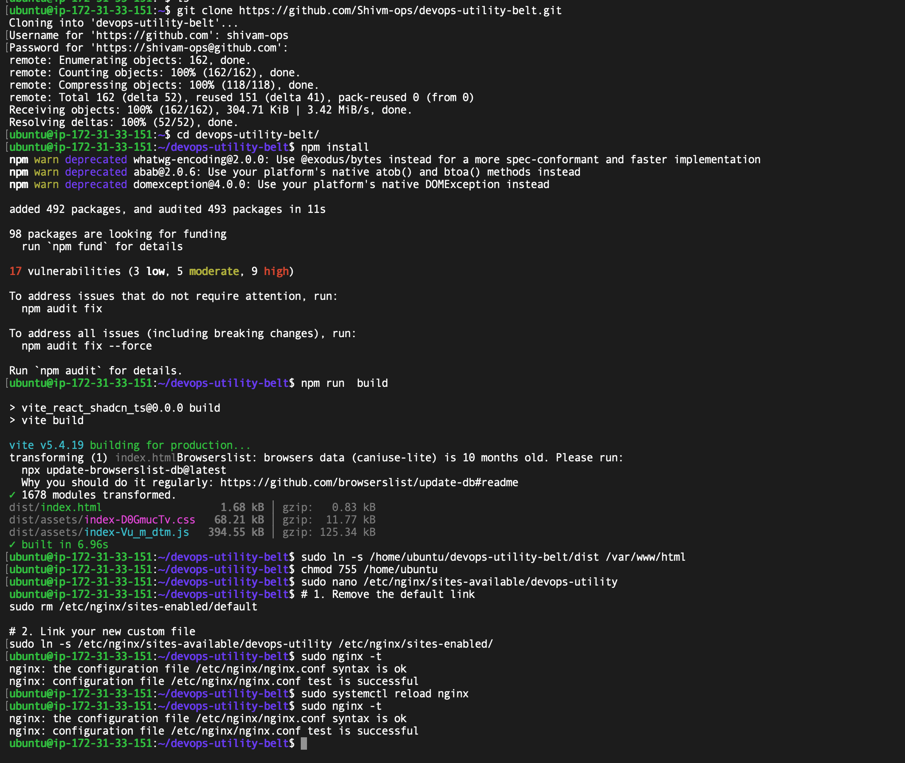
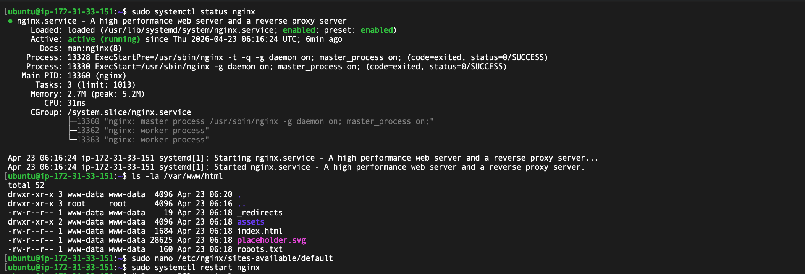

# AWS EC2: Linux Server Deployment 🚀

This branch showcases my ability to manage a Virtual Private Server (VPS). Instead of using automated tools, I manually configured a Linux environment to host my DevOps Utility Belt web app.

## 🛠️ Deployment Steps

*   **The Server:** I launched an Ubuntu EC2 instance on AWS.
*   **The Web Server:** I installed and configured Nginx to serve my React build files.
*   **The Networking:** I opened specific "Security Group" doors (Port 80/443) so the world can see my site.

## 📸 Deployment Proofs

### 1. The Setup
I cloned my code directly onto the server and built it using Node.js.

### 2. The Infrastructure
My active instance running in the AWS Cloud.

### 3. The Live Result
Accessing the site through the server's direct IP address.

## 🎯 Key Skills Demonstrated

*   **Linux Terminal:** Comfortable with SSH and command-line management.
*   **Nginx Mastery:** Configured routing and reverse proxy settings.
*   **Cloud Networking:** Managed AWS Security Groups and Public IPs.

---

## 🔗 View Live EC2 Deployment
👉 **[Insert Live EC2 Link Here]**

---
*Developed as a technical showcase of server management and AWS infrastructure.*
