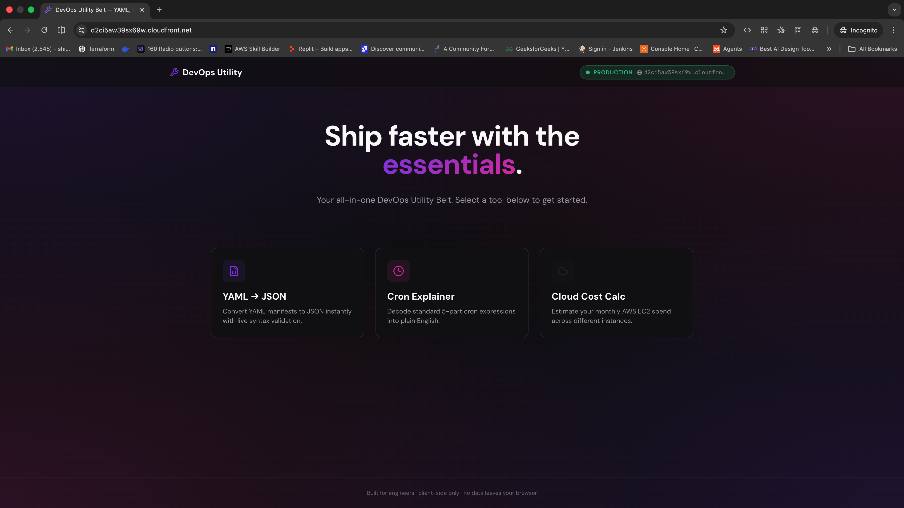

# AWS CloudFront CDN Deployment 🌍

Welcome to the CloudFront deployment branch of the DevOps Utility Belt portfolio! This branch focuses on the Content Delivery Network (CDN) infrastructure, demonstrating how to globally distribute a React/Vite Single Page Application (SPA) using Amazon CloudFront.

## 🏗️ Architecture & Deployment Strategy

To achieve enterprise-grade performance and high availability, this architecture leverages **AWS CloudFront** in front of our web origin (S3 bucket or ELB). CloudFront aggressively caches static assets (HTML, CSS, JS, Images) at AWS Edge Locations all around the world.

By offloading request processing to the CDN, we ensure that users download the portfolio from a data center physically closest to them, drastically reducing latency and improving the User Experience (UX).

## 🌍 CloudFront Distribution Configuration

The CloudFront distribution is configured to intercept all web traffic and route it efficiently.

*Figure 1: The CloudFront distribution showing the assigned domain name and its active deployment state, serving as the global entry point for the application.*

*Figure 2: The general configuration of the distribution, illustrating the setup for edge caching, pricing class selection, and optimized content delivery.*

## 🔒 Security & Optimization

Integrating CloudFront brings several out-of-the-box DevOps and Security benefits:

- **SSL/TLS Offloading:** Custom SSL certificates via AWS Certificate Manager (ACM) are attached directly to the distribution to enforce HTTPS natively.
- **Origin Access Control (OAC):** Secures the underlying origin by restricting direct access—the application can only be reached *through* the CDN.
- **DDoS Protection:** Implicitly protected by AWS Shield Standard at the edge, mitigating volumetric and state-exhaustion attacks before they reach the origin.

## 📈 Results & Impact

Implementing a CDN-first approach yields massive architectural benefits:

- **Global Low Latency:** Time-to-First-Byte (TTFB) is minimized worldwide since content is served from the closest edge location.
- **Extreme Cost-Efficiency:** Caching assets at the edge significantly reduces the number of requests and data transfer out of the origin storage, slashing infrastructure costs.
- **Infinite Scalability:** CloudFront naturally scales to handle massive traffic spikes without any manual intervention or origin scaling required.

## 🌐 Live Environment

Check out the globally accelerated static portfolio here:

👉 **[Insert CloudFront Live Link Here]**

---
*Developed as a technical showcase of cloud-native networking, content delivery, and AWS proficiency.*
